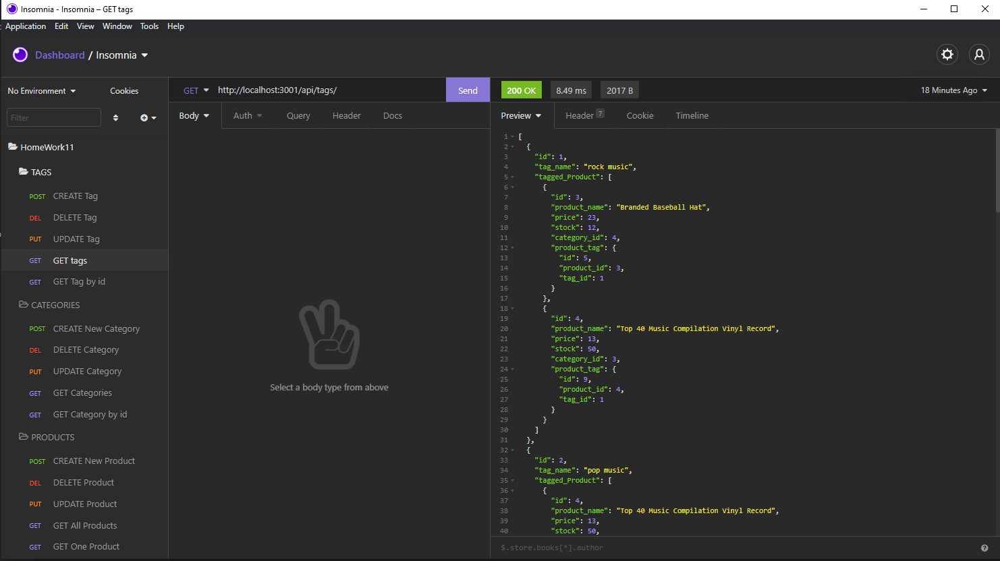

# Object Relational Mapping E-Commerce Backend 

## Table of Contents

- [Installation](#installation)
- [Description](#description)
- [URLs](#urls)
- [Usage](#usage)
- [Images](#images)
- [Credits](#credits)
- [License](#license)
- [Contributions](#contributions)
- [Tests](#tests)
- [Questions](#questions)

## Installation

To install you will need to first create the schema through MySQL Shell, from there you will need to use npm i to get all the packages. Once downloaded, you can simply seed the server using npm run seed, and to start the server you need to type either nodemon server.js or you can type npm run watch. Do make sure you have insomnia downloaded of you wont be able to do anything other than GET requests.

## Description

This is a backend E-commerce database that can be viewed with GET, and edited using POST/PUT/DELETE using insomnia application.

## URLs

GitHub repository: https://github.com/ajlineb/Object-Relational-Mapping-E-Commerce-Backend

Video: https://drive.google.com/file/d/1_69k8XytOA9x1h-eTfmMnBvGLvNfLnkL/view

## Usage

The user can create their own e-commerce database with any type of items they would like, setting their prices and what areas they belong to. Increadiably useful for larg amounts of items that are being sold and a way for users to keep up with everything.

## Images

## Credits

Bootcamp of UNC Chapel Hill for some starter code.

## License

MIT License

## Contributions

Send an email for ideas!

## Tests

Once the database server is up and running you can use insomnia to test each request.

## Questions

Contact by:  
GitHub Username: [ajlineb](https://github.com/ajlineb)  
Email: anthonylinebaugh95@gmail.com
